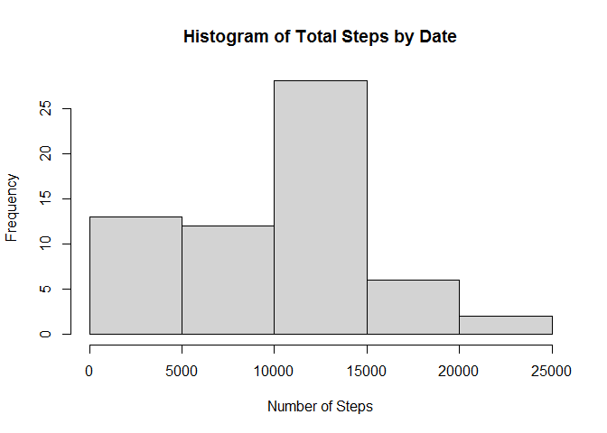

## Loading and preprocessing the data

1 Load the data(i.e. read.csv())

```r
setwd("C:\\Users\\ASHISH BAVALIYA\\Desktop\\Coursera\\C5P1")
activityData <- read.csv("activity.csv")

names(activityData)
```

```
## [1] "steps"    "date"     "interval"
```

```r
str(activityData)
```

```
## 'data.frame':	17568 obs. of  3 variables:
##  $ steps   : int  NA NA NA NA NA NA NA NA NA NA ...
##  $ date    : chr  "2012-10-01" "2012-10-01" "2012-10-01" "2012-10-01" ...
##  $ interval: int  0 5 10 15 20 25 30 35 40 45 ...
```

2 Process/transform the data (if necessary) into a format suitable for your analysis


## What is mean total number of steps taken per day?

1 Calculate the total number of steps taken per day

```r
totalStepsByDate <- tapply(activityData$steps, activityData$date, sum, na.rm = TRUE)
```

2 If you do not understand the difference between a histogram and a barplot, research the difference between them. Make a histogram of the total number of steps taken each day

```r
hist(totalStepsByDate, xlab = "Number of Steps", main = "Histogram of Total Steps by Date")
```

<!-- -->

3 Calculate and report the mean and median of the total number of steps taken per day

```r
meanStepsTakenPerDay <- mean(totalStepsByDate)
meanStepsTakenPerDay
```

```
## [1] 9354.23
```
The mean of total number of steps by date is 9354.2295082

```r
medianStepsTakenPerDay <- median(totalStepsByDate)
medianStepsTakenPerDay
```

```
## [1] 10395
```
The median of total number of steps by date is 10395


## What is the average daily activity pattern?

1 Make a time series plot (i.e. type = "l") of the 5-minute interval (x-axis) and the average number of steps taken, averaged across all days (y-axis)


```r
meanStepsByInterval <- tapply(activityData$steps, activityData$interval, mean, na.rm=TRUE)
plot(unique(activityData$interval), meanStepsByInterval, type = "l", xlab = "Interval", ylab = "Steps", main = "Time Series Plot of Average Steps by Interval")
```

<!-- -->

2 Which 5-minute interval, on average across all the days in the dataset, contains the maximum number of steps?


```r
intervalWithMostSteps <- activityData$interval[which.max(meanStepsByInterval)]
intervalWithMostSteps
```

```
## [1] 835
```
5-minute time interval at 08:35 to 08:40 has most steps recorded. 


## Imputing missing values

1 Calculate and report the total number of missing values in the dataset (i.e. the total number of rows with NAs)

```r
NoOfMissingVals <- sum(is.na(activityData$steps))
```

2 Devise a strategy for filling in all of the missing values in the dataset. The strategy does not need to be sophisticated. For example, you could use the mean/median for that day, or the mean for that 5-minute interval, etc.

We will use mean by interval that is already calculated and is stored in meanStepsByInterval variable

```r
getMeanOfInterval<-function(interval){
    meanStepsByInterval[as.character(interval)]
}
```

3 Create a new dataset that is equal to the original dataset but with the missing data filled in.


```r
newActivityData <- activityData
for(i in 1:nrow(newActivityData))
{
    if(is.na(newActivityData[i,1]))
    {
        newActivityData[i,1] <- getMeanOfInterval(newActivityData[i,3])                      
    }
}
str(newActivityData)
```

```
## 'data.frame':	17568 obs. of  3 variables:
##  $ steps   : num  1.717 0.3396 0.1321 0.1509 0.0755 ...
##  $ date    : chr  "2012-10-01" "2012-10-01" "2012-10-01" "2012-10-01" ...
##  $ interval: int  0 5 10 15 20 25 30 35 40 45 ...
```

4 Make a histogram of the total number of steps taken each day and Calculate and report the mean and median total number of steps taken per day. Do these values differ from the estimates from the first part of the assignment? What is the impact of imputing missing data on the estimates of the total daily number of steps?

```r
newTotalStepsByDate <- tapply(newActivityData$steps, newActivityData$date, sum, na.rm = TRUE)
hist(newTotalStepsByDate, xlab = "Number of Steps", main = "Histogram of Total Steps by Date(Missing Values Filled)")
```

<!-- -->

```r
newMeanStepsTakenPerDay <- mean(newTotalStepsByDate)
newMeanStepsTakenPerDay
```

```
## [1] 10766.19
```
After filling NAs the mean of total number of steps by date is 1.0766189\times 10^{4}


```r
newMedianStepsTakenPerDay <- median(newTotalStepsByDate)
newMedianStepsTakenPerDay
```

```
## [1] 10766.19
```
After filling NAs the median of total number of steps by date is 1.0766189\times 10^{4}


## Are there differences in activity patterns between weekdays and weekends?

1 Create a new factor variable in the dataset with two levels - "weekday" and "weekend" indicating whether a given date is a weekday or weekend day.

```r
newActivityData$date <- as.Date(newActivityData$date, format = "%Y-%m-%d")
newActivityData$day <- weekdays(newActivityData$date)
for (i in 1:nrow(newActivityData)) {
    if (newActivityData[i,]$day %in% c("Saturday","Sunday")) {
        newActivityData[i,]$day<-"weekend"
    }
    else{
        newActivityData[i,]$day<-"weekday"
    }
}
```

2 Make a panel plot containing a time series plot (i.e. type = "l") of the 5-minute interval (x-axis) and the average number of steps taken, averaged across all weekday days or weekend days (y-axis). See the README file in the GitHub repository to see an example of what this plot should look like using simulated data.


```r
weekdata <- subset(newActivityData, newActivityData$day == "weekday")
weekenddata <- subset(newActivityData, newActivityData$day == "weekend")
t1 <- tapply(weekdata$steps, weekdata$interval, mean)
t2 <- tapply(weekenddata$steps, weekenddata$interval, mean)

par(mfrow = c(2,1))
plot(unique(weekdata$interval), t1, type = "l", xlab = "Interval", ylab = "Steps", main = "Average Steps per Interval during Weekday")
plot(unique(weekenddata$interval), t2, type = "l", xlab = "Interval", ylab = "Steps", main = "Average Steps per Interval during Weekend")
```

<!-- -->
